<!-- HERO SECTION -->

---

## 🧭 About Me
💡 **Problem Solver** – I design and automate **scalable systems**  
⚡ **Efficiency-Driven** – My focus is **zero-downtime deployments**  
🚀 **Innovation Lover** – Always exploring **new tech** to push boundaries  

---

## 🛠 Tech Arsenal

---

## 🚀 Featured Projects

### 🔹 [Distributed Task Orchestrator](https://github.com/Bhanu-Sharma-7/task-orchestrator)  
_Fault-tolerant workflow engine using **Go & Redis Streams**_  
`Go • Redis • gRPC • Kubernetes`

### 🔹 [Edge AI Monitor](https://github.com/Bhanu-Sharma-7/edge-ai-monitor)  
_Real-time IoT anomaly detection using **TensorFlow Lite**_  
`Python • TensorFlow Lite • MQTT • Rust (WASM)`

---

## 📊 GitHub Analytics

  
  

  

---

## 🗓 My Dev Journey

```mermaid
timeline
    title Bhanu Sharma - Developer Journey
    2021 : 🚀 Started cloud & system design learning
    2022 : 📚 Mastered Go, Kubernetes, Terraform
    2023 : 🛠 Built Distributed Task Orchestrator
    2024 : 🤖 Developed Edge AI Monitor for IoT
    2025 : 🔥 Building advanced DevOps pipelines



---

📫 Contact

<div align="center">📧 Email: bhanusharma14581@gmail.com
💼 LinkedIn: linkedin.com/in/bhanu-sharma-dev
🌐 Portfolio: bhanu-sharma-portfolio.vercel.app

</div>
---

<div align="center">✨ "Turning ideas into scalable reality" ✨

</div>
```

---